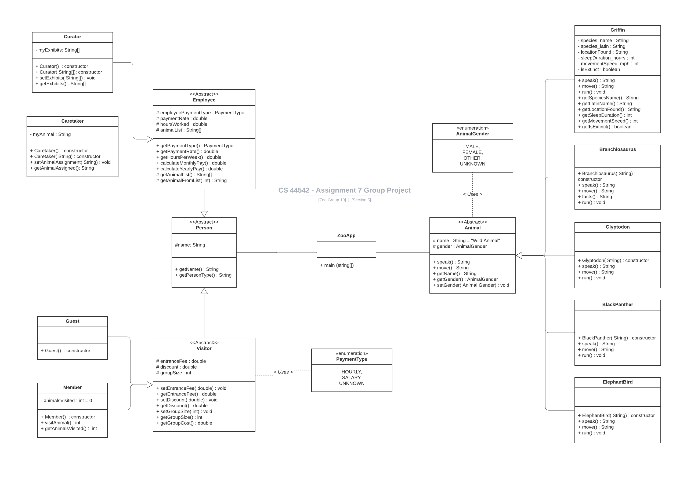

## ZooApp Project Description

We are Group #10 for CS44542 Section 5 (Object Oriented Programming)

This project is a demonstration of the skills we've learned in OOP. We are building a zoo full of animals to visit and designating types of visitors and employees that work there.  Visitors should be able to specify what membership level they possses, see a resulting fee once they visit, and be able to view the details of the animals at the zoo in a concise manner.  Employees will be able to see their job description, how much they are paid, how often they work, and the animals or exhibits they are in charge of.

## Visit Our Application on Heroku
- [Heroku WebApp](https://dashboard.heroku.com/apps/group10zoo/deploy/github)

## View Our Project API
 - [Click Here - Hosted on GitHub Pages](https://dierale.github.io/ZooGroup10/)

## View Our Testing Coverage here:
 - [Test Coverage Using Jacoco 0.8.7](https://dierale.github.io/ZooGroup10/Zoo10Group-Coverage.html)

## Project Contributors:
 - [Alex Dieringer](https://github.com/Dierale)
 - [Manish Goud Bandharapu](https://github.com/919610362)
 - [Hemanth Kumar Reddy Pidaparathy](https://github.com/Hemanthkumarreddy)
 - [Hemanth Sai Reddy Velamuri](https://github.com/hemanthsaireddyvelamuri)
 - [Jayanth Naramsetty](https://github.com/jayanthnaramsetty)

## Additional Details
Noteable Project Functionalities:
 - ZooIndexController uses a callAnimalRun() function to dynamically call each Animal subclass's run(). This means we can add more animals at will to our getAnimalList() and it wont need to be updated. As long as the name in the list matches the animal's java file name we're safe
 - ZooIndexController uses formatLineBreaks() to parse through console output and give Spring neater output. Line breaks are replaced with '\ ' and as long as the view uses 'th:utext=' instead of 'th:text' it formats

---

For the initial project design reference view the UML displayed below
 - Note: PaymentType is wrongfully linked to Visitor instead of Employee
 - However, code for PaymentType is properly implemented
 - An updated UML with any additional functionality beyond requirements will be added if needed

